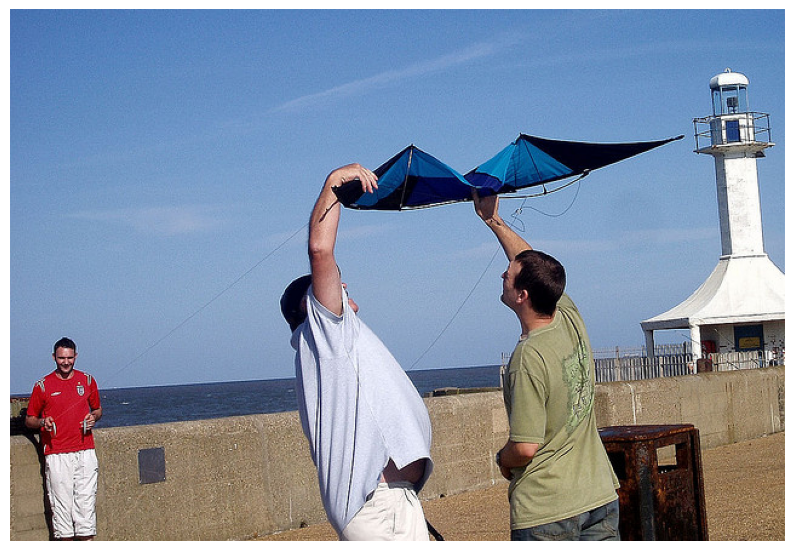
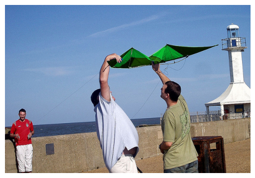
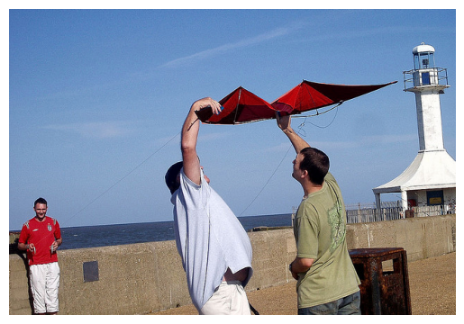
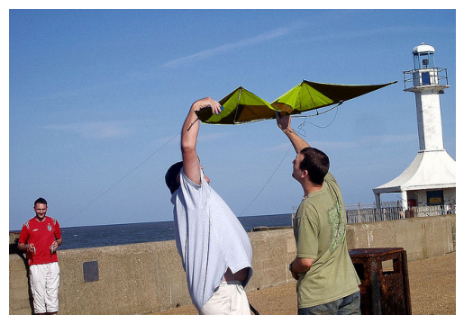
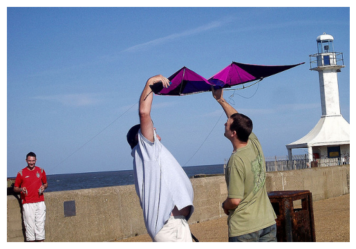
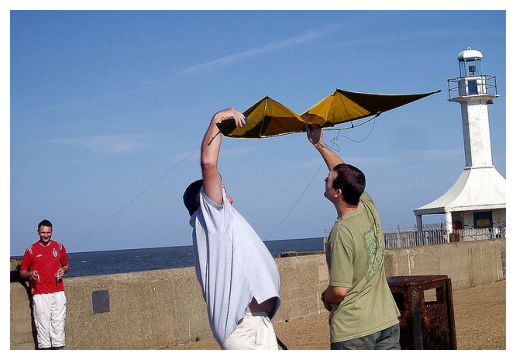

# Object recoloring using a mask segmentation and pre-processing techniques
## Overview
Object recoloring is an open task and it is usually achieved trough a machine vision algorithm.

In this project I used just pre-processing techniques, starting from an image and the segmentation mask of the object I want to recolor.

## How to use
```
recolor(image, mask, original_color, target_color):
 # Pre-processing algorithm
 return colored_image
```

The recoloring function takes as input:
1. An image in **RGB format**
2. A segmentation mask of the object to recolor
3. The original color of the object
4. The color I want the recolored image to be

The output is the recolored image in **RGB format**.


## Limits
1. The algorithm does not currently takes in account multiple color objects. The segmentation mask should contain a **single color object**.
2. Results with darker colors, in a dark environment, for an object having a complex texture are currently poor

## Purpose
This task is part of a bigger project which final purpose is to make the ai systems more responsive to color attribute information.

Briefly, the object recoloring algorithm is used on a subset (big as possible) of MS COCO dataset and for each example are generated #n color variations (#n = number of colors studied). Each color variation of an image is correlated to a variation of the corrispondent caption. The syntethic dataset generated is then used to train an ai system to distanciate the latent rapresentation of images with a different color of the caption, and to minimize the distance between the image and the right color caption.

More accurate explanation will be provided in an external link.


## Recolored examples

Original:



Recolored:








## References
Starting Paper:  https://openreview.net/pdf?id=EZYvU2oC6J

Vimp Group: http://vimp.math.unipd.it/publications.html#


## 

This project is done thanks to the collaboration of the Unipd VIMP Group