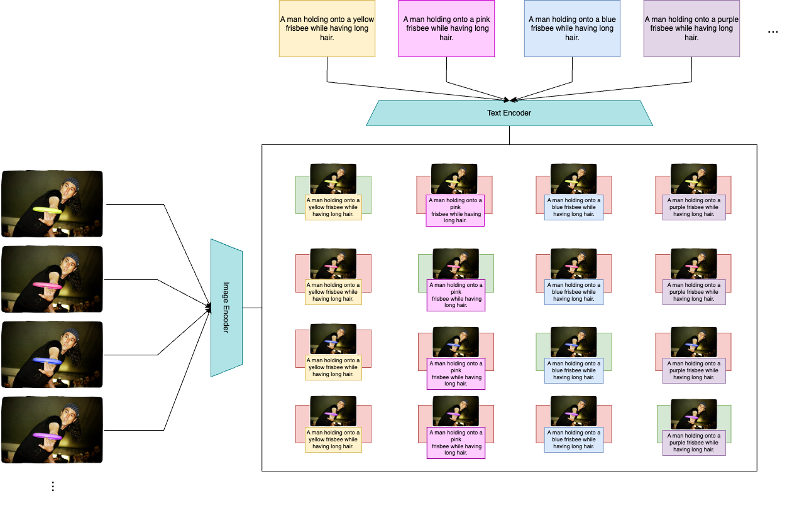

# 🎨 Enhancing Color Recognition: A Pipeline to Make Visual-Text Models More Sensitive to Colors

## 📄 Abstract

Recent developments and the growing proliferation of Vision-Language Models (VLMs) have led to significant advancements in the field of computer vision. Numerous state-of-the-art models achieve performance comparable to human levels on traditional datasets; however, they still exhibit limited sensitivity to specific image attributes, such as spatial relationships between objects and chromatic characteristics, occasionally making gross errors on tasks that are intuitive for humans. In this work, we propose a pipeline to enhance the color recognition capabilities of one of the most renowned and widely used models in computer vision: CLIP (Contrastive Language–Image Pre-training). The proposed methodology involves generating a synthetic dataset composed of chromatic variants of segmented objects, derived from images and annotations from the MSCOCO dataset. The fine-tuning algorithm employed is based on a contrastive learning approach.

## 🛠️ Installation Guide

This section provides detailed instructions for setting up the project environment on **macOS**, **Windows**, and **Linux**. Follow the steps corresponding to your operating system to ensure a smooth installation process.

### 📝 Prerequisites

- **Python 3.12**: Ensure that Python 3.12 is installed on your system. You can download it from the [official website](https://www.python.org/downloads/).
- **Conda (Optional)**: While Conda is not strictly required, it is recommended for managing dependencies and environments efficiently. You can download Conda from the [official website](https://docs.conda.io/en/latest/miniconda.html).

### 1. Clone the Repository

Begin by cloning the repository to your local machine:

```bash
git clone https://github.com/Lorenzopensource/enhancing-color-recognition.git
cd enhancing-color-recognition
```

### 2. Create a Virtual Environment

1. Creating a virtual environment ensures that project dependencies are isolated from other projects on your system.

Using venv (Cross-Platform)

```bash
python3.12 -m venv venv
```

2. Activate the virtual environment:

- macOs and Linux:
```bash
source venv/bin/activate
```

- Windows:
```bash
venv/Scripts/activate
```

After activation, your terminal prompt should resemble:

```ruby
(venv) user@machine:~/path/to/enhancing-color-recognition$
```

### 3. Install Dependencies

With the virtual environment activated, install the required Python packages:

```bash
pip install --upgrade pip
pip install -r requirements.txt
python -m spacy download en_core_web_sm
```

### 4. Install GroundingDINO, SAM and the Flickr8k Dataset

The project relies on GroundingDINO and Segment Anything Models (SAM) for image segmentation and grounding tasks.

#### GroundingDINO
1. Clone the GroundingDINO Repository:

```bash
git clone https://github.com/IDEA-Research/GroundingDINO.git
cd GroundingDINO
```

2. Install GroundingDINO:

```bash
pip install -e .
```

3. Download GroundingDINO Weights:

```bash
wget https://github.com/IDEA-Research/GroundingDINO/releases/download/tiny/groundingdino_tiny.pth -P weights/
```

4. Return to the Main Directory:

```bash
cd ../
```

#### Segment Anything Model (SAM)
1. Clone the Segment Anything Repository:

```bash
git clone https://github.com/facebookresearch/segment-anything.git
cd segment-anything
```

2. Install SAM:

```bash
pip install -e .
```

3. Download SAM Weights:

```bash
wget https://dl.fbaipublicfiles.com/segment_anything/sam_vit_h_4b8939.pth -P weights/
```

4. Organize the Directory Structure:

After installation, ensure your project directory resembles the following structure:

```graphql
enhancing-color-recognition/
├── GroundingDINO/
│   ├── groundingdino/          # Main GroundingDINO code
│   ├── weights/                 # Folder containing GroundingDINO model weights
│   │   └── groundingdino_tiny.pth
│   ├── setup.py                 
│   └── ...                     
├── segment-anything/           # Main Segment Anything code
│   ├── weights/                 # Folder containing SAM model weights
│   │   └── sam_vit_h_4b8939.pth
│   ├── segment-anything/
│   │   └── ...
│   ├── predictor.py                
│   └── ...                     
├── scripts/                              
│   └── ... 
```   

Reorganize the segment-anything Directory:

Move the segment_anything and weights directories out of the nested segment-anything/segment-anything/ directory to the root segment-anything/ directory and delete the nested folder:

```bash
mv segment-anything/segment_anything .
mv segment-anything/weights segment_anything/
rm -rf segment-anything
```

Your directory should now look like:

```graphql
enhancing-color-recognition/
├── GroundingDINO/
│   ├── groundingdino/
│   ├── weights/
│   │   └── groundingdino_tiny.pth
│   ├── setup.py
│   └── ...
├── segment_anything/
│   ├── weights/
│   │   └── sam_vit_h_4b8939.pth
│   ├── predictor.py                
│   └── ...                     
├── scripts/                              
│   └── ...
```

Return to the Main Directory:

```bash
cd ../
```

#### Flickr8k 
The Flickr8k dataset is required for evaluating the correlation with human judgment.

1. Download the Flickr8k Dataset:

Visit the Flickr8k dataset page to request access.
Once approved, download the dataset files.
Extract and Move the Dataset:

2. Extract the downloaded dataset archive.

3. Move the Flickr8k folder to the main repository directory:

```graphql
enhancing-color-recognition/
├── Flickr8k/
│   ├── Flickr8k_Dataset/
│   └── Flickr8k_text/
├── GroundingDINO/
├── segment-anything/
├── scripts/
├── data/
├── models/
├── requirements.txt
├── README.md
└── ...       
```              

##  🏋️ Usage
After completing the installation and fine-tuning steps, you can utilize the enhanced CLIP model for various color recognition tasks. Detailed usage instructions and examples can be found in the scripts/ directory.

### 🔄 Generating Synthetic Datasets

To generate a synthetic dataset of chromatic variants:

1. Set Specifics:

Adjust the configuration parameters in the scripts/synthetic_dataset_generation.py file as needed to suit your specific requirements.

2. Run the Script:

```bash
python scripts/synthetic_dataset_generation.py
```

### 🏋️ Fine-Tuning the Model

Configure the necessary parameters and execute the fine-tuning script.

1. Set Specifics:

Adjust the configuration parameters in the scripts/fine-tuning.py file as needed to suit your specific requirements.

2. Run the Fine-Tuning Script:

```bash
python scripts/fine-tuning.py
```

### 📊 Evaluating Model Performance

After fine-tuning, evaluate the performance of your enhanced CLIP model to assess its color recognition capabilities.

1. Set Specifics:

Ensure that the evaluation scripts are configured correctly, especially paths to datasets and model checkpoints. You can adjust parameters in the scripts/evaluation.py file as needed.

2. Run the Evaluation Script:

The evaluation script allows you to choose which performance metrics to evaluate: task-specific performance, correlation with human judgments, or both.

- Evaluate Both Task and Human Performance (Default):

```bash
python scripts/evaluation.py
```


- Evaluate Only Task Performance:

```bash
python scripts/evaluation.py --performance task
```

- Evaluate Only Human Correlation Performance:

```bash
python scripts/evaluation.py --performance human
```

3. Review the Results:

After running the evaluation, the script will output performance metrics and generate a graph summarizing the results.

## 📞 Contact
For further assistance, please contact lorenzo.pasqualotto01@gmail.com.

*This project was developed as part of a thesis at the University of Padua (Unipd) during the academic year 2023-2024.*
---

